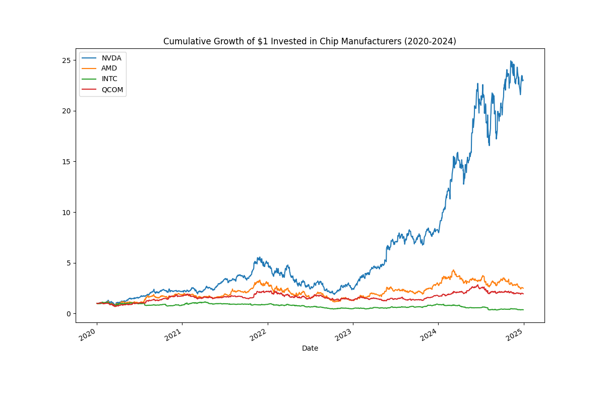
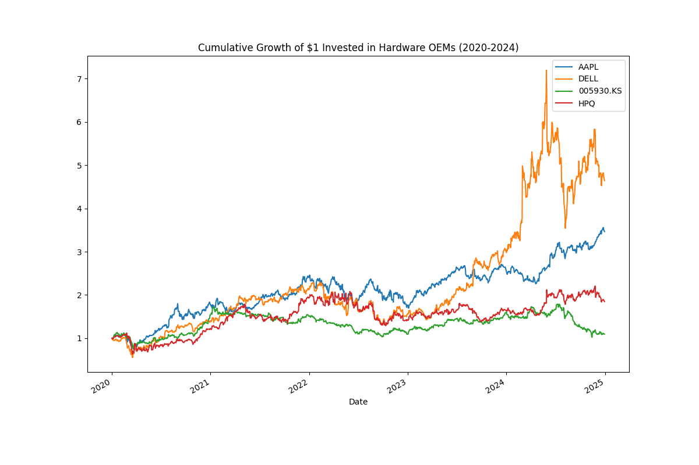
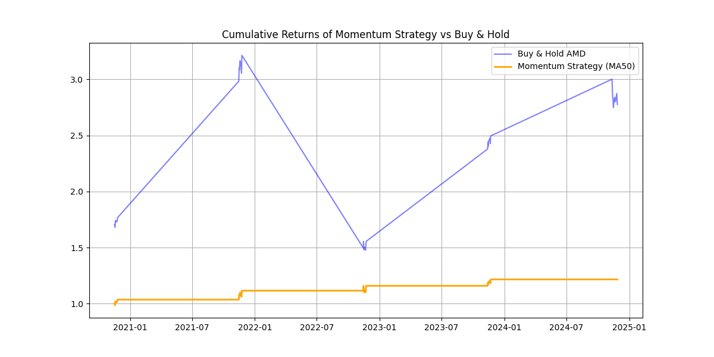

# The AI Chip Wars: A Correlation & Lead/Lag Analysis

This is a Python-based project analyzing the stock market relationship between semiconductor suppliers and the hardware original equipment manufacturers (OEMs for short) that use them in their devices.

**Project Question:** How correlated are chip suppliers (like Nvidia, AMD) to hardware makers (like Apple, Dell)? Is there a "lead/lag" effect, and can these relationships be used using statistical arbitrage or momentum-based algorithmic trading strategies?

---

## Tools & Libraries Used

* **Python 3**
* **yfinance:** To download historical stock data from the Yahoo Finance API.
* **pandas:** For all data manipulation, cleaning, and analysis (calculating returns, correlations, and lead/lag shifts).
* **matplotlib & seaborn:** To visualize the results.

---

## Analysis & Findings

### 1. Correlation of Daily Returns (2020-2025)

After analyzing 4 years of daily returns, I found that the highest correlation usually falls between two chip manufacturers. For example, NVIDIA and AMD have the highest correlation, at r = 0.75. These results strongly imply that the market views the chip manufacturers and the hardware OEMs as one giant interconnected business, where a rise in one correlates to a rise in another.

### 2. Lead/Lag Effect

To test for a predictive relationship, I shifted just the semiconductor supplier data forward by one day. My analysis found that every correlation between a lagged chip manufacturer and a hardware OEM was negative, but close to 0. The lowest correlations were between a lagged and unlagged chip manufacturer (lagged Qualcomm & unlagged NVIDIA had a correlation of r = 0.13). These results seemingly imply that there is little to no predictive relationship between a chip supplier's stock yesterday and a hardware OEM's stock today.

### 3. Performance & Growth

These charts show the cumulative growth of $1 invested in both semiconductor suppliers and hardware OEMs. The clear winner in the chip manufacturers is NVIDIA (ending at around $23 for each $1 invested), while the clear winner in the hardware OEMs is Dell (ending at a little less than $5 for each $1 invested). The losing chip supplier is Intel and the losing device manufacturer is Samsung (both making barely over $1 for each $1 invested). Both growth charts share a similar patterns, with a low start, small dip in early 2020, constant flucutation, and an end with a single stock finishing way above the others.

### 4. Strategy Backtest 1: Statistical Arbitrage (Pairs Trading)

Given the high same-day correlation between NVIDIA and AMD (r = 0.75), I hypothesized that a mean-reversion "Pairs Trading" strategy would be more profitable than buying and holding the stock. I built a backtester to track the price spread between the two assets, triggering a buy signal (using a Z-score > 1.0) when AMD became statistically underpriced compared to NVDA. 

**Result:** The strategy failed to beat a simple Buy & Hold benchmark. The data revealed that the 2020-2024 AI semiconductor market was in a strict **Momentum Regime**. The stocks rarely mean-reverted; instead, they experienced occasional spikes. 

### 5. Strategy Backtest 2: Trend Following (Momentum)

Recognizing the regime shift from mean-reversion to momentum, I pivoted the algorithm. I designed a Trend-Following strategy using a 50-day Simple Moving Average (SMA) on AMD. The rule I set was to stay invested while the price is above the 50-day SMA, and move to cash when it drops below.

**Result:** In terms of raw total return, the Momentum strategy underperformed Buy & Hold ($1.22 vs $2.77). The lagging nature of the 50-day average caused the algorithm to miss sudden, volatile spikes in AI stock prices.

### 6. Risk Management & Capital Preservation (The Quant Pivot)

While the Momentum strategy underperformed in total return, quantitative finance prioritizes **Risk-Adjusted Returns**. I ran a Maximum Drawdown analysis to measure the exact downside risk of both the benchmark and the momentum algorithm.

* **Buy & Hold Max Drawdown:** -54.08%
* **Momentum Strategy Max Drawdown:** -5.12%

**Conclusion:** During the analyzed period, a Buy & Hold investor suffered a catastrophic 54% loss of portfolio value. The Momentum algorithm successfully identified the market crash and shifted to cash, restricting the absolute worst-case loss to just 5.12%. 

Overall, this project proves that while beating a historic tech bull market in just profits is highly improbable, algorithmic trend-following provides vastly superior downside protection and capital preservation.